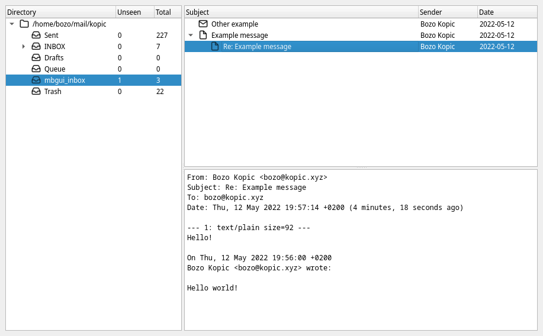

mbgui
=====

Maildir GUI based on `mblaze <https://github.com/leahneukirchen/mblaze>`_

Requirements
------------

* gtk3
* mblaze

Build
-----

::

    $ ./build.sh

After running build script, ``mbgui`` is avalaible inside ``build`` folder.

Run
---

::

    $ build/mbgui path/to/maildir ...

All command line arguments are passed to ``mdirs`` command (with additional
``-a`` argument).

By pressing ``Return`` key while message is selected in messages list, selected
message is printed to standard output. This can be used for piping ``mbgui``
with other mblaze commands.

License
-------

mbgui - Maildir GUI based on mblaze

Copyright (C) 2022 Bozo Kopic

This program is free software: you can redistribute it and/or modify
it under the terms of the GNU General Public License as published by
the Free Software Foundation, either version 3 of the License, or
(at your option) any later version.

This program is distributed in the hope that it will be useful,
but WITHOUT ANY WARRANTY; without even the implied warranty of
MERCHANTABILITY or FITNESS FOR A PARTICULAR PURPOSE.  See the
GNU General Public License for more details.

You should have received a copy of the GNU General Public License
along with this program.  If not, see <http://www.gnu.org/licenses/>.
